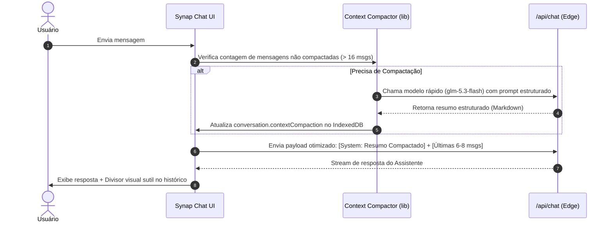

# Especificação de Design: Context Compaction Automático (Synap)

**Data:** 10/10/2026  
**Status:** Aprovado  
**Tipo:** Feature Arquitetural / Otimização de Janela de Contexto  

---

## 1. Visão Geral e Motivação
Em sessões longas de desenvolvimento e chat no Synap, o histórico de mensagens acumula dezenas de mensagens, anexos de arquivos, diffs de código e chamadas de ferramentas (*tool calls*). Isso gera dois problemas críticos:
1. **Consumo Excessivo de Tokens:** Cada nova pergunta do usuário envia todo o histórico prévio, inflando custos e latência.
2. **Degradação de Raciocínio (Context Bloat / Amnésia):** Modelos de linguagem perdem foco em instruções importantes quando sobrecarregados com logs e mensagens intermediárias antigas.

Inspirado no padrão de **Context Compaction** utilizado pelo Claude Code e grandes agentes de engenharia de software, esta funcionalidade permite que o Synap compacte automaticamente conversas longas sem apagar mensagens da visualização do usuário.

---

## 2. Princípios de Design

1. **Transparência para o Usuário (Zero Perda Visual):** Na interface (UI), o usuário continua visualizando todas as mensagens ao rolar para cima. Nenhuma mensagem é excluída do histórico local.
2. **Compactação Semântica Estruturada:** O resumo preserva os 4 pilares vitais de uma sessão de código:
   - 🎯 **Objetivo & Metas:** O que o usuário está construindo e restrições.
   - 🛠️ **Decisões Técnicas:** Tecnologias escolhidas, padrões e arquitetura acordada.
   - 📂 **Arquivos & Estado:** Arquivos lidos, criados ou modificados, além de mudanças pendentes.
   - ⏳ **Próximos Passos:** O que ficou pendente ou em andamento.
3. **Compatibilidade Multi-Dispositivo (Cloud-Ready):** A estrutura de dados de compactação é serializável e persistida no próprio objeto da conversa (`Conversation`), permitindo sincronização futura com Supabase/PostgreSQL entre PC e dispositivos móveis.
4. **Execução Assíncrona & Rápida:** A compactação roda em segundo plano usando um modelo veloz (`z-ai/glm-5.3-flash`), sem travar a navegação do usuário.

---

## 3. Arquitetura de Dados

### 3.1. Tipos TypeScript (`src/lib/types.ts`)

```typescript
export interface ContextCompaction {
  summary: string;
  compactedUpToMessageId: string;
  timestamp: number;
  originalMessageCount: number;
}

export interface Conversation {
  id: string;
  title: string;
  messages: Message[];
  createdAt: number;
  updatedAt: number;
  model: string;
  reasoningEffort: 'low' | 'high' | 'max';
  isPlanMode?: boolean;
  activeRepo?: ActiveRepoState | null;
  contextCompaction?: ContextCompaction; // Objeto de contexto compactado
}
```

---

## 4. Fluxo de Execução



### 4.1. Gatilho de Compactação
- **Limite:** Conversas com mais de 16 mensagens onde as mensagens após o último ponto de corte ultrapassam 12 mensagens.
- **Janela Preservada:** As últimas 6 mensagens permanecem intocadas no payload da API para manter a coerência imediata da conversa.
- **Mensagens Compactadas:** Todas as mensagens anteriores à janela recente são consolidadas no sumário.

### 4.2. Prompt de Compactação Estruturada
```text
Você é o módulo de Context Compaction do Synap.
Sua missão é gerar um resumo denso, técnico e estruturado do histórico a seguir para que a IA da próxima interação tenha total clareza do contexto sem precisar do histórico bruto.

Estruture exatamente nas seguintes seções:
# RESUMO DA SESSÃO (CONTEXT COMPACTION)
- **Objetivo Principal:** [Metas e intenção do usuário]
- **Decisões Técnicas:** [Tecnologias, abordagens e restrições acordadas]
- **Arquivos & Estado:** [Arquivos lidos, alterados e commits realizados]
- **Pendências & Próximos Passos:** [O que falta ser feito ou validado]

Histórico a compactar:
{mensagens_anteriores}
```

---

## 5. Interface do Usuário (UI)

1. **Divisor no Chat (`src/components/chat-message.tsx` ou componente dedicado):**
   - Um marcador visual sutil entre a mensagem anterior ao corte e a primeira mensagem pós-corte:
     ```
     ── ⚡ Contexto compactado automaticamente (X mensagens resumidas para otimizar tokens) ──
     ```
   - Botão para "Ver resumo compactado" em um modal ou accordion expansível caso o usuário queira auditar o que a IA está lembrando.
2. **Total Transparência:** Zero perda de mensagens visuais na lista do chat.

---

## 6. Tratamento de Erros e Casos de Borda

- **Falha de Rede na Compactação:** Se a chamada para gerar o resumo falhar, a conversa continua com o histórico normal (degradação graciosa).
- **Conversas Pequenas:** Nenhuma ação é tomada se a conversa tiver menos de 16 mensagens.
- **Compactações Incrementais:** Se a conversa continuar crescendo após uma compactação prévia, a nova compactação pega o resumo anterior + novas mensagens intermediárias, mantendo o processo contínuo e escalável.

---

## 7. Critérios de Aceite
1. Tipagem `ContextCompaction` adicionada e validada em `src/lib/types.ts`.
2. Módulo `src/lib/context-compactor.ts` criado com funções puras e testáveis:
   - `shouldCompact(conversation: Conversation): boolean`
   - `compactConversation(conversation: Conversation, apiKey: string): Promise<ContextCompaction>`
   - `prepareMessagesForApi(conversation: Conversation): Message[]`
3. Integração com `src/App.tsx` na montagem do payload e no salvamento do IndexedDB via `src/lib/storage.ts`.
4. Renderização do divisor visual no chat informando a compactação.
5. Verificação com `npx tsc --noEmit` e `npm run build` sem erros.
